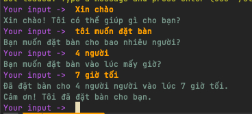

## Rasa

### Cài đặt Rasa

Để cài đặt Rasa, bạn cần thực hiện các bước sau:

- **Bước 1: Cài đặt Python**: Rasa yêu cầu Python (phiên bản 3.7 đến 3.10). Bạn có thể tải Python từ trang web chính thức và cài đặt.
- **Bước 2: Tạo môi trường ảo**: Để tránh xung đột giữa các gói, bạn nên tạo một môi trường ảo:

    ```bash
    python3 -m venv rasa_env
    source rasa_env/bin/activate  # Đối với Linux/macOS

    ```

- **Bước 3: Cài đặt Rasa**: Sau khi tạo môi trường ảo, bạn cài đặt Rasa bằng lệnh:

    ```bash
    pip install rasa

    ```

- **Bước 4: Kiểm tra cài đặt**: Để kiểm tra xem Rasa đã được cài đặt thành công chưa, bạn có thể chạy lệnh:

    ```bash
    rasa --version

    ```

### **Khởi tạo một dự án Rasa mới**

Mô tả bài toán
Chúng ta sẽ xây dựng một chatbot có thể:

Nhận diện ý định (intent) của người dùng muốn đặt bàn.
Trích xuất các thông tin như số lượng người (number_of_people) và thời gian (time).
Lưu trữ các thông tin này trong slots.
Sử dụng các thông tin trong slots để phản hồi hoặc thực hiện hành động.

1. **Tạo một dự án Rasa mới**:
Chúng ta sẽ sử dụng lệnh `rasa init` để khởi tạo một dự án mới. Điều này sẽ tạo ra cấu trúc thư mục cơ bản cho dự án của bạn và cung cấp một mẫu bot.

    ```bash
    rasa init

    ```

    Khi chạy lệnh này, Rasa sẽ hỏi bạn có muốn huấn luyện một mô hình mới không. Chọn **Yes** để huấn luyện mô hình với dữ liệu mẫu mà Rasa cung cấp.

2. **Cấu trúc thư mục**:
Sau khi khởi tạo, bạn sẽ thấy các thư mục và tệp sau:

```arduino
rasa-demo/
│
├── actions/
│   └── actions.py
├── config.yml
├── domain.yml
├── data/
│   ├── nlu.yml
│   ├── stories.yml
│   └── rules.yml
└── ...

```
- **data/nlu.yml**: Chứa các intents và ví dụ training cho mô hình NLU.
- **data/stories.yml**: Chứa các stories để huấn luyện Rasa Core.
- **data/rules.yml**: Chứa các rules đơn giản cho bot.
- **domain.yml**: Xác định các intents, entities, actions, và responses của bot.
- **config.yml**: Cấu hình mô hình NLU và Core.

### **Bước 3: Xây dựng NLU cho dự án**

1. **Sửa đổi `nlu.yml`** để thêm các intents cho dự án của bạn. Ví dụ, chúng ta sẽ thêm các intents cho việc đặt bàn và hỏi giờ mở cửa:

    Mở tệp `data/nlu.yml` và cập nhật như sau:

    ```yaml
    version: "3.0"
    nlu:
    - intent: greet
      examples: |
        - Xin chào
        - Chào bạn
        - Hello
        - Hi

    - intent: book_table
      examples: |
        - Tôi muốn đặt bàn
        - Đặt bàn cho tối nay
        - Làm ơn đặt giúp tôi một bàn
        - Đặt chỗ cho [4 người](number_of_people) vào lúc [7 giờ tối](time)
        - Tôi muốn đặt bàn vào [ngày mai](time) cho [4 người](number_of_people)

    - intent: ask_opening_hours
      examples: |
        - Giờ mở cửa của bạn là gì?
        - Khi nào bạn mở cửa?
        - Bạn mở cửa lúc mấy giờ?

    ```

2. **Thêm các thực thể (entities)** trong cùng tệp `nlu.yml`. Các thực thể như số lượng người (`number_of_people`) và thời gian (`time`) sẽ được sử dụng để trích xuất thông tin từ câu hỏi của người dùng.

### **Bước 4: Xây dựng Stories, Rules và Actions**

1. **Sửa đổi `stories.yml`** để tạo ra kịch bản hội thoại cho việc đặt bàn. Mở tệp `data/stories.yml` và cập nhật như sau:

    ```yaml
    version: "3.0"
    stories:
    - story: Đặt bàn thành công
      steps:
        - intent: book_table
        - action: utter_ask_number_of_people
        - intent: inform
        - action: utter_ask_time
        - intent: inform
        - action: action_book_table
        - action: utter_confirm_reservation

    - story: Hỏi giờ mở cửa
      steps:
        - intent: ask_opening_hours
        - action: utter_opening_hours

    ```

2. **Sửa đổi `rules.yml`** để tạo các quy tắc đơn giản. Mở tệp `data/rules.yml` và cập nhật như sau:

    ```yaml
    version: "3.0"
    rules:
    - rule: Gửi lời chào
      steps:
        - intent: greet
        - action: utter_greet

    - rule: Hỏi giờ mở cửa
      steps:
        - intent: ask_opening_hours
        - action: utter_opening_hours

    ```

3. **Sửa đổi `rules.yml`** để tạo các quy tắc đơn giản. Mở tệp `data/rules.yml` và cập nhật như sau:
Tạo tệp actions.py:
Bây giờ, hãy tạo tệp actions.py trong thư mục actions/ và thêm mã sau để triển khai hành động action_book_table:

```python
# actions/actions.py

from rasa_sdk import Action, Tracker
from rasa_sdk.executor import CollectingDispatcher
from rasa_sdk.types import DomainDict

class ActionBookTable(Action):

    def name(self) -> str:
        return "action_book_table"

    def run(self, dispatcher: CollectingDispatcher,
            tracker: Tracker,
            domain: DomainDict) -> list:

        # Giả lập việc lấy các thực thể từ tracker
        number_of_people = tracker.get_slot("number_of_people")
        time = tracker.get_slot("time")

        # Tạo phản hồi
        response = f"Đã đặt bàn cho {number_of_people} người vào lúc {time}."

        # Gửi phản hồi tới người dùng
        dispatcher.utter_message(text=response)

        return []
```

### **Bước 5: Cấu hình Responses và Actions**

1. **Sửa đổi `domain.yml`** để định nghĩa các intents, entities, actions và responses. Mở tệp `domain.yml` và cập nhật như sau:

    ```yaml
    version: "3.0"

    intents:
      - greet
      - book_table
      - ask_opening_hours

    entities:
      - number_of_people
      - time

    responses:
      utter_greet:
        - text: "Xin chào! Tôi có thể giúp gì cho bạn?"

      utter_ask_number_of_people:
        - text: "Bạn muốn đặt bàn cho bao nhiêu người?"

      utter_ask_time:
        - text: "Bạn muốn đặt bàn vào lúc mấy giờ?"

      utter_confirm_reservation:
        - text: "Cảm ơn! Tôi đã đặt bàn cho bạn."

      utter_opening_hours:
        - text: "Chúng tôi mở cửa từ 8 giờ sáng đến 10 giờ tối mỗi ngày."

    actions:
      - action_book_table

    ```

2. **Tạo hành động tùy chỉnh** (nếu cần). Hành động `action_book_table` có thể được tạo trong tệp `actions/actions.py` nếu bạn muốn bot thực hiện một số xử lý phức tạp như kiểm tra cơ sở dữ liệu hoặc API để đặt bàn.

### **Bước 6: Huấn luyện và kiểm thử bot**

1. **Huấn luyện bot** bằng cách sử dụng lệnh sau:

    ```bash
    rasa train

    ```

2. **Kiểm thử bot** bằng cách chạy:

- **Khởi động Action Server:**
  Trước khi chạy bot, bạn cần khởi động Action Server. Mở một cửa sổ terminal mới và chạy lệnh sau để khởi động Action Server:
  ```bash
  rasa run actions
  ```
  Lệnh này sẽ khởi động Action Server và chờ các yêu cầu từ Rasa bot.

- **Cấu hình `endpoints.yml`:**
- **Kiểm tra tệp `endpoints.yml`:**
  Đảm bảo rằng bạn có tệp `endpoints.yml` trong thư mục gốc của dự án và tệp này chứa cấu hình chính xác để kết nối đến Action Server.

  Nếu tệp `endpoints.yml` chưa tồn tại, bạn cần tạo nó với nội dung như sau:
  ```yaml
  action_endpoint:
    url: "http://localhost:5055/webhook"
  ```
  Đây là cấu hình mặc định khi bạn chạy Action Server trên máy tính của mình, nó sẽ lắng nghe ở cổng `5055`.

- **Khởi động lại Rasa bot:**

- Sau khi cấu hình đúng `endpoints.yml` và khởi động Action Server, bạn có thể khởi động lại Rasa bot trong một cửa sổ terminal khác:
    ```bash
    rasa shell

    ```

    Bạn có thể thử các câu hỏi như:

    - "Xin chào"
    - "Tôi muốn đặt bàn cho 4 người vào lúc 7 giờ tối"
    - "Giờ mở cửa của bạn là gì?"

  

3. **Chạy bot với giao diện web** (tùy chọn):
Nếu bạn muốn chạy bot trên giao diện web hoặc tích hợp với các ứng dụng khác, bạn có thể sử dụng lệnh sau:

    ```bash
    rasa run

    ```


